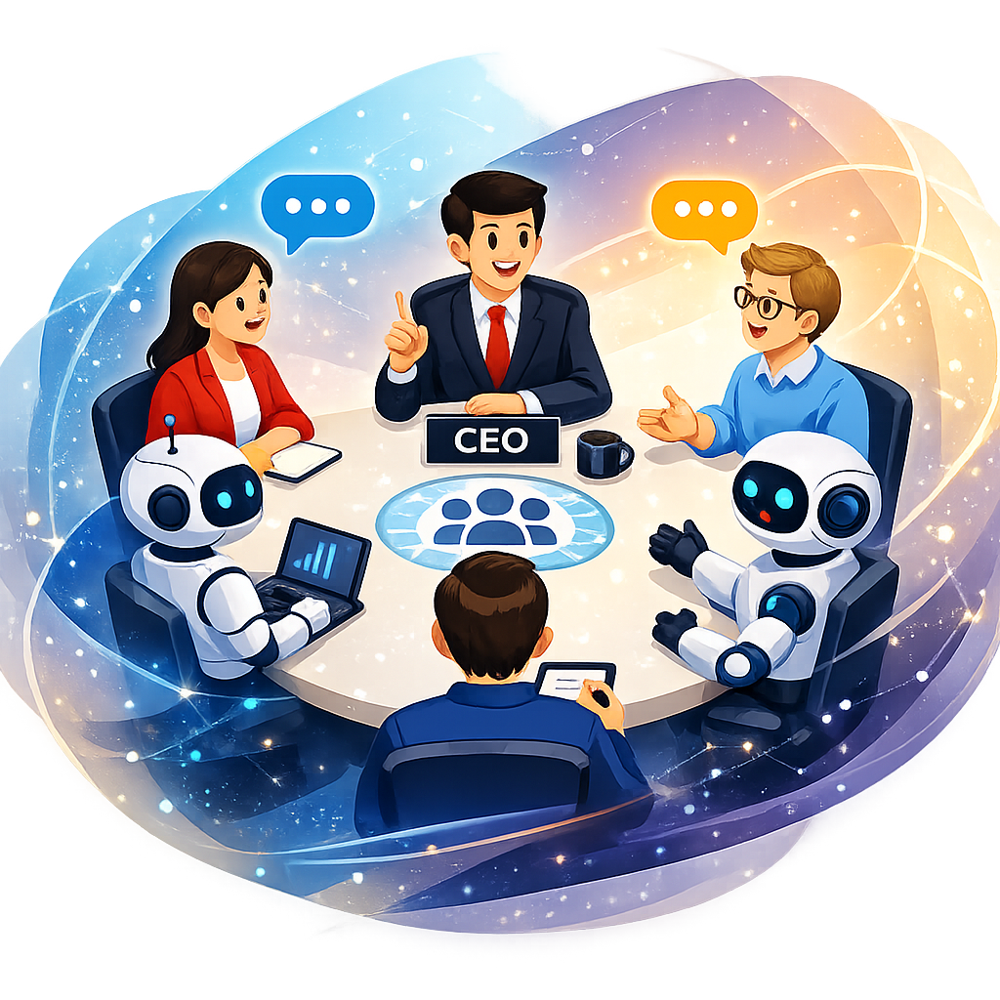
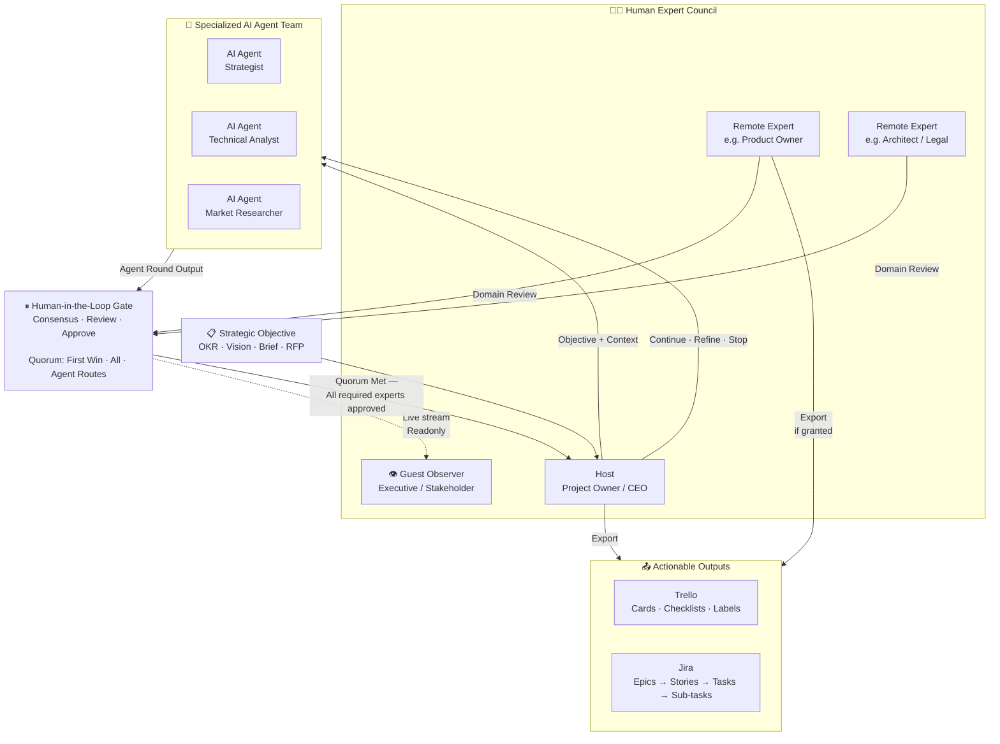

    

# CouncilAI — Project Charter

**The Ultimate CEO Tool**  
*Where human experts and AI agents govern as one team*

---

## Executive Summary

Every consequential business decision is made by a council — a group of specialists who bring different lenses, challenge each other's assumptions, and commit to a path forward together. That is how real organizations work.

Today's AI tools ignore this reality. They are built for a single user interacting with a collection of AI assistants in isolation. When the output leaves the chat window, the rest of the organization — the domain experts who must validate, the stakeholders who must align, the downstream teams who must execute — are cut out of the process entirely.

CouncilAI closes that gap. It is the first AI collaboration platform designed for the team, not the individual — placing specialized AI agents inside the structured review loops that real organizations already use to make decisions, and producing outputs that land natively in the PM tools teams already trust.

---

## The Problem

### The Single-Window Fallacy

Every current agentic AI system shares a foundational assumption: **one human, many AI assistants.** The human is the hub; the agents are spokes. One person launches the session, one person reads all the outputs, one person decides when to continue or stop.

This model produces impressive demos. It breaks down the moment it leaves the lab and enters the enterprise.

**Why it fails in practice:**

- **No single expert can validate everything.** A product strategy session requires a product owner's market lens, an architect's feasibility read, a legal advisor's risk assessment, and a finance lead's cost view — simultaneously, not sequentially. No one person holds all four.
- **Isolated AI output has no organizational mandate.** When one person runs a private AI session and presents the result to the team, every other stakeholder starts from distrust. The work happened without them. They were not part of the process. The socialization burden falls entirely on the individual who ran the session.
- **Real decisions require real consensus.** Organizations have built review gates, approval workflows, and quorum requirements for good reasons. AI systems that bypass these structures generate outputs that organizations cannot act on — regardless of how accurate those outputs are.

### The Market Gap

The AI industry has invested billions in making individual contributors more productive. It has invested almost nothing in making **teams** more productive as a collective unit. The result is a growing category of shadow AI: tools used by individuals, producing outputs that then need to be re-validated, re-explained, and re-socialized through the organization's actual decision-making structures — defeating much of the productivity gain before it can compound.

The next frontier of agentic AI is not more capable agents. It is AI that knows how to work inside a human organization.

---

## Market Context & Why Now

Three forces are converging to create the market for team-native agentic AI:

**1. Agentic AI has reached capability maturity.**  
Multi-agent frameworks can now reliably decompose complex objectives, specialize roles, and maintain context across extended conversations. The infrastructure for agentic AI teams is production-ready. What is missing is the human-team integration layer.

**2. Organizations are remote-first and async by design.**  
The distributed team is the default organizational unit, not the exception. Collaboration tools built around the assumption of co-location — or even synchronous availability — have already lost the market. Any AI collaboration platform must work across geographies, time zones, and permission levels simultaneously.

**3. PM tooling is the enterprise's trust layer.**  
Trello and Jira are not just task trackers — they are the shared source of truth that cross-functional teams coordinate around. AI outputs that land natively in these tools arrive with instant organizational credibility. AI outputs that remain in a chat window do not. Bridging the gap from AI conversation to actionable PM artifact is the last mile that current tools fail to cross.

---

## Vision Statement

> **Make AI a member of the team — accountable to the whole council, not a servant to one.**

---

## The Solution

CouncilAI is a structured human-AI collaboration platform built around the concept of the **council**: a team of human domain experts and a team of specialized AI agents that work together inside a governed, multi-round deliberation loop.

Unlike a single-user AI assistant session, a CouncilAI session is a **multi-stakeholder governance event**:

- The **host** (project owner, CEO, product lead) defines the strategic objective and governs the session lifecycle.
- **Remote expert participants** — each a domain specialist — join from their own authenticated session, review the AI agents' output from within their area of expertise, and provide input that shapes the next round. Their participation is recorded; their domain accountability is explicit.
- **Guest observers** — executives, clients, board members — watch the session in real time without the ability to intervene. Transparency and auditability without noise.
- A **specialized AI agent team** is configured to mirror the organization's own expertise structure: an AI strategist, an AI technical analyst, an AI market researcher — each with a distinct role, a distinct LLM model, and a distinct system prompt. The AI team is a digital twin of the human team's domain expertise.
- A **human-in-the-loop gate** pauses the AI team after each round. The session does not advance until the human council has reviewed the output and committed a response — ensuring every AI-generated step has human accountability before the next one begins.
- A **quorum mechanism** ensures the gate is met correctly: *first response wins*, *all required experts must respond*, or *the agent team routes the next turn to the specific human participant best suited to evaluate that round's output*.
- The final output is **exported directly into Trello or Jira** — not copied and pasted, but structured, hierarchical, and immediately actionable in the tools the team already uses.

---

## Collaboration Model

---

## Key Capabilities

### 1. Multi-Expert Collaboration Gate
Every AI agent round pauses for human review before the team advances. Domain experts join from their own authenticated session, review the output within their area of expertise, and respond. The run advances only when the configured quorum is satisfied. No expert is bypassed; no step is unreviewed.

### 2. Configurable AI Agent Teams
Organizations configure agent teams to mirror their own structure: roles, responsibilities, LLM models, and system prompts. An agent is not a generic chatbot — it is a specialist with a defined domain, a specific model capability, and a system prompt that reflects the organization's standards. Teams can operate in round-robin order (fixed rotation) or selector-routed mode (an LLM picks the best-qualified agent for each turn based on conversation context and defined roles).

### 3. Flexible Quorum Consensus
Three quorum modes match different organizational cultures and decision speeds:
- **First response wins** — speed-optimized; the first expert to respond (host or any remote participant) drives the next round. Useful for exploratory sessions and high-cadence planning.
- **All must respond** — governance-optimized; every configured expert contributes before the run continues. Useful for high-stakes decisions, regulatory environments, and multi-budget approvals.
- **Agent planner decides** — the AI team itself determines which human expert is best suited to evaluate each output and routes the gate accordingly. Useful for complex, multi-domain sessions where the right reviewer varies per round.

### 4. Structured Export to PM Tools
AI output is not a chat log. Every session's output is extracted into structured artifacts — cards and checklists for Trello; epics, stories, tasks, and sub-tasks for Jira — and pushed directly in a single action. Jira Software supports full hierarchical issue trees, with parent-child relationships resolved and sprint assignments applied automatically during the push.

### 5. Contextual Knowledge Sharing
Participants attach documents, spreadsheets, presentations, and images at any point in the session — at the start to provide background, mid-session to redirect the AI team, or in the gate input to add expert domain context. Text is extracted and fed to agents; images are processed via vision-capable models. Knowledge arrives when it is needed, not only at session start.

### 6. Transparent Guest Observation
Any session can be shared with a read-only guest link — no account or configuration required. Guests watch agent rounds and human responses stream in real time, supporting executive oversight, client transparency, and external audit without disrupting the deliberation in progress.

### 7. Audit-Ready Session History
Every human input, every agent output, and every gate decision is persisted with full fidelity. Sessions are resumable from any checkpoint. Project versioning tracks configuration changes across saves and clones, so each session can be tied to the exact team configuration that produced it.

---

## Target Users

| Role | Participation Mode | Primary Need |
|---|---|---|
| **Host** (Project Owner, CPO, CEO) | Full control — owns session, governs objective | Run and govern the AI-human collaboration loop |
| **Domain Expert** (PO, Architect, Legal, Finance) | Authenticated remote participant — own view | Review AI output within their domain; input shapes the next round |
| **Executive / Client** | Guest observer — readonly, no account needed | Transparent visibility into AI-driven decisions without disruption |
| **AI Configurator** (Platform Admin) | Configuration interface | Configure agent teams, LLM models, integrations, and quorum rules |

---

## Value Proposition

| Status Quo — Single-user AI tools | CouncilAI |
|---|---|
| One user interacts with all agents — must be expert in every domain to validate output | Each human expert reviews only their own domain; no single person bears all accountability |
| AI output lives in a chat window; re-socialization burden falls entirely on the individual | AI output is produced inside the team's existing review loop — no re-socialization required |
| No organizational mandate — "one person's AI session" | Every expert's response is on record — organizational mandate is built into the process |
| Output must be manually formatted and copied into PM tools | Structured push to Trello / Jira in a single action; hierarchy preserved |
| Remote team members have no visibility unless someone shares screenshots | Remote experts participate as first-class citizens in real time from their own authenticated page |
| No audit trail — who validated what, when? | Full persisted history; resumable sessions; version-tracked configurations |

---

## Strategic Differentiators

**1. Team-native, not individual-native**  
No other agentic AI platform structures multi-human collaboration as a first-class feature. Remote expert participation, quorum consensus, and guest transparency are built into the core architecture — not bolted on as afterthoughts. The session model is a governed deliberation, not a chat with extras.

**2. Governed AI, not autonomous AI**  
CouncilAI does not let agents run to completion and present a finished artifact for post-hoc review. Every round is gated. Every step has a human accountable for it before the next begins. In regulated industries, high-stakes product decisions, and any context where accountability matters, governance is not a constraint — it is the value delivered.

**3. Organization-mirroring agent configuration**  
Agent teams are configured to reflect the organization's own specialization structure: same roles, same domain responsibilities, same knowledge embedded in system prompts. The AI team mirrors the human team's expertise, not a generic assistant's capabilities. When a domain expert reviews an AI agent's output, they are reviewing the output of an agent configured specifically for that domain.

**4. Native PM tool integration as the trust layer**  
The artifact of a CouncilAI session is not a document — it is a structured backlog in the tool the team already uses to coordinate work. This removes the last-mile barrier that kills AI adoption: the step between "AI produced this" and "the team is working on this."

---

## Scope

### In Scope — Current

- Multi-agent team configuration (round-robin and selector routing)
- Human-in-the-loop gate with three quorum modes (first-win, all, agent-routes)
- Remote participant authentication and per-user export grant
- Guest readonly session sharing via secure link
- Trello export (cards, checklists, custom fields, labels)
- Jira Software, Service Desk, and Business export (hierarchical issue trees)
- MCP tool integration for AI agents (stdio and streamable HTTP transports)
- Multi-modal attachment support (documents, images, spreadsheets, presentations)
- Session versioning and resumable checkpoints
- Azure Blob storage; Redis coordination; MongoDB persistence
- Three deployment topologies: standalone container, Docker Compose, Kubernetes (Helm)

### Out of Scope — Current

- Real-time co-editing of agent configurations during an active session
- Native video or audio participation channels
- Integration with calendaring or meeting scheduling tools
- Consumer-facing self-serve SaaS onboarding
- Role-based access control (RBAC) within a shared workspace

---

## Success Metrics

### Qualitative
- Domain experts report reviewing AI output from within their own expertise area, not compensating for others' domains
- Organizations report AI output arriving with built-in organizational mandate — no separate re-socialization effort required
- Hosts report that exporting to Trello or Jira produces immediately actionable backlogs without manual reformatting or hierarchy reconstruction

### Quantitative (Target)
- ≥ 3 domain experts per session on multi-expert configured projects
- ≥ 80% of sessions with active remote participants complete with quorum committed — not host-only override
- ≥ 70% of sessions with Trello or Jira integration configured push at least one export
- Session resume rate ≥ 40%, indicating multi-session deliberation workflows rather than single-run outputs
- Guest link activation rate ≥ 50% of sessions with executive-level owners

---

*CouncilAI — The Ultimate CEO Tool*  
*Where human experts and AI agents govern as one team.*
