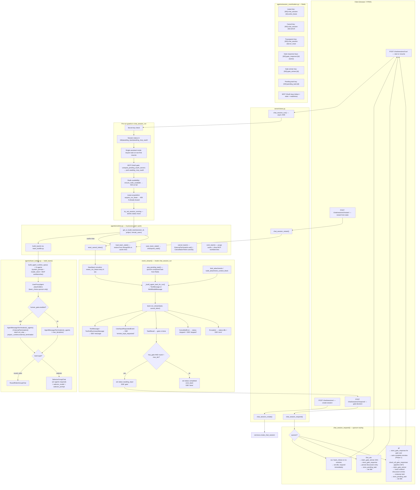

# Chat Session Lifecycle — Architectural Analysis

## Overview Diagram



---

## 1. Session Initialization — `chat_session_create()`

`POST /chat/sessions/` → `server/views.py:645`

- Secret-key gated only.
- Calls `services.create_chat_session(project_id, description)` → MongoDB document with `status: "idle"`, empty `discussions[]`, `current_round: 0`.
- Returns HTMX OOB swaps: sidebar list + history panel + hidden `#active-session-id` input.
- **No team is built here** — team construction is deferred to the first `/run/`.

---

## 2. Run / Resume — `chat_session_run()`

`POST /chat/sessions/<id>/run/` — async, returns `text/event-stream`.  
Source: `server/views.py:865`

### Pre-run guard chain (sequential, fail-fast)

| Guard | Failure code |
|---|---|
| Secret key | 403 |
| Status not in `{idle, awaiting_input, awaiting_mcp_oauth}` | 409 |
| Single-assistant mode + non-first resume + empty task+attachments | 400 |
| Pending MCP OAuth servers → park `awaiting_mcp_oauth` | 409 |
| `ensure_redis_available()` — Redis ping | 503 |
| `acquire_run_lease()` — Redis SET NX | 409 |
| `try_set_session_running()` — atomic status move | 409 |

### Inside `event_stream()` (the SSE generator)

1. **Team resolution** — `get_or_build_team(session_id, project, remote_users)` (`agents/runtime.py`):
   - **Cache hit** → reuses existing in-process `RoundRobin/SelectorGroupChat` (keeps AutoGen internal history).
   - **Cache miss** → calls `build_team()`, then `load_team_state()` from MongoDB `agent_state`.

2. **Heartbeat** — a background coroutine calls `renew_run_lease()` every `REDIS_RUN_HEARTBEAT_SECONDS` (default 20 s). If the Lua compare-and-set fails (ownership lost), it cancels the token immediately.

3. **Task assembly**:
   - Checks Redis `pop_pending_task()` first (quorum-composed task deposited by `/respond/`).
   - Otherwise reads `task` + `attachment_ids` from POST body.
   - Builds `MultiModalMessage` for vision images; plain string otherwise.
   - Raw user-typed text (not attachment context) persists to `discussions[]` (rule 71).

4. **`team.run_stream()` loop** emits:
   - `TextMessage / ToolCallSummaryMessage` → SSE `"message"` → append to `pending_messages`.
   - `UserInputRequestedEvent` → SSE `"remote_input_requested"` (breadcrumb for `team_choice` quorum).
   - `TaskResult` → commits messages + checkpoints state → decides **gate vs done**.

5. **Termination decision** at `TaskResult`:
   - `has_gate AND (single_assistant_mode OR round < max_iter)` → `status = awaiting_input`, SSE `"gate"`.
   - Otherwise → `status = completed`, `evict_team()`, SSE `"done"`.

6. **Error paths**:
   - `CancelledError` → flush pending, checkpoint, `status = stopped`, SSE `"stopped"`.
   - Other exceptions → flush, checkpoint, `status = idle`, SSE `"error"` (user-friendly via `_friendly_run_error()`).
   - `finally` always: stop heartbeat, `release_run_lease()`, `clear_cancel_signal()`, end OTel span.

---

## 3. Team Building — `build_team()`

Source: `agents/team_builder.py`

```
project.agents → build_agent_runtime_spec() × N
  ├── system_prompt resolved (+ objective injected)
  ├── model_client built from agent_models.json
  └── MCP workbenches built (scope: none | shared | dedicated)

+ UserProxyAgent placeholders (team_choice quorum only)
  └── placeholder input_func → auto-returns "Continue."

termination:
  human_gate ON  → AgentMessageTermination(n_agents) | ExternalTermination()
  human_gate OFF → AgentMessageTermination(n_agents × max_iterations)

team_type:
  "round_robin" → RoundRobinGroupChat(agents, termination)
  "selector"    → SelectorGroupChat(agents, selector_model, selector_prompt, termination)
                  (requires ≥ 2 agents; invalid for single-assistant)
```

Key invariant: `AgentMessageTermination` counts only messages where `source != "user"` to avoid the off-by-one from AutoGen's built-in `MaxMessageTermination` (rule 70).

---

## 4. Quorum & Remote Users

Config lives in `project.human_gate` (validated in `server/schemas.py:331`):

```python
{
  "enabled": True,
  "name": "You",          # gate user (sanitized identifier)
  "quorum": "na|all|first_win|team_choice",
  "remote_users": [{"name": ..., "description": ...}]
}
```

`quorum` is forced to `"na"` if no `remote_users` are configured.

### Quorum routing in `chat_session_respond()`

Source: `server/views.py:1440`

| `quorum` | Behavior |
|---|---|
| `na` | No quorum logic — gate user responds, session immediately set to `idle`. |
| `team_choice` | No quorum logic (same as `na`) — `UserProxyAgent` placeholders handle the in-run flow via their auto-returning `input_func`. |
| `first_win` | `claim_gate_winner()` (Redis SET NX) — first POST wins. Stores response + persists discussion entry + deposits `store_pending_task()` → set `idle`. Concurrent 409. |
| `all` | All expected names must respond. Phase 1: gate user posts → remotes auto-completed with empty entries → `check_all_gate_responses()` (pipeline GET) → `claim_gate_winner()` → compose joint task → `store_pending_task()` → set `idle`. |

### Redis keys for quorum

Source: `agents/session_coordination.py`

| Key pattern | Purpose |
|---|---|
| `{NS}:gate_response:{id}:{name}` | Per-responder input; TTL-expiring |
| `{NS}:gate_winner:{id}` | SET NX race-winner; prevents double-resume |
| `{NS}:pending_task:{id}` | Quorum-composed task; consumed atomically via GETDEL in `pop_pending_task()` |

---

## 5. Stop / Cancel

- **Graceful stop** (`chat_session_respond(action="stop")` or Stop button): `evict_team()` + `status = stopped`.
- **Cross-instance cancel** (`POST /chat/sessions/<id>/stop/`): `signal_cancel()` → Redis cancel key → SSE loop calls `is_cancel_signaled()` every message → triggers `cancel_token.cancel()`.
- **In-process cancel** (`cancel_team()`): `ExternalTermination.set()` (graceful finish of current agent turn) → `CancellationToken.cancel()` (hard interrupt fallback).

---

## 6. State Persistence & Resume

- After every `TaskResult`: `save_team_state()` → serialized AutoGen state → MongoDB `chat_sessions.agent_state`.
- `MAX_AGENT_STATE_BYTES` (default 1 MB) guards document size — overflow is non-fatal (run completes; resume is unavailable).
- On cache miss (server restart / new instance): `load_team_state()` restores the full AutoGen conversation history so agents resume with context.
- Teams are **process-local** — horizontal scaling requires sticky sessions at the load balancer.

---

## Key Redis Key Reference

| Key pattern | Purpose | TTL source |
|---|---|---|
| `{NS}:chat_session:{id}:active_lease` | Active run ownership (Lua compare-and-set) | `REDIS_RUN_LEASE_TTL_SECONDS` (default 300 s) |
| `{NS}:chat_session:{id}:cancel` | Cross-instance cancel signal | `REDIS_CANCEL_SIGNAL_TTL_SECONDS` (default 120 s) |
| `{NS}:chat_session:{id}:run_trace` | W3C traceparent for OTel span reattach | Same as lease TTL |
| `{NS}:gate_response:{id}:{name}` | Per-responder gate input | `_GATE_RESPONSE_TTL` |
| `{NS}:gate_winner:{id}` | First-win / all-quorum race lock | `_GATE_RESPONSE_TTL` |
| `{NS}:pending_task:{id}` | Quorum-composed task for next `/run/` | `_PENDING_TASK_TTL` |
| `{NS}:mcp_oauth:run:{id}:{server}:token` | Session-scoped MCP OAuth Bearer token | JWT `exp` claim (floor 60 s) |
| `{NS}:mcp_oauth_state:{state}:meta` | PKCE state for OAuth Authorization Code flow | Short-lived |
| `{NS}:mcp_oauth:test:{project}:{server}:status` | Credential test status | Short-lived |
