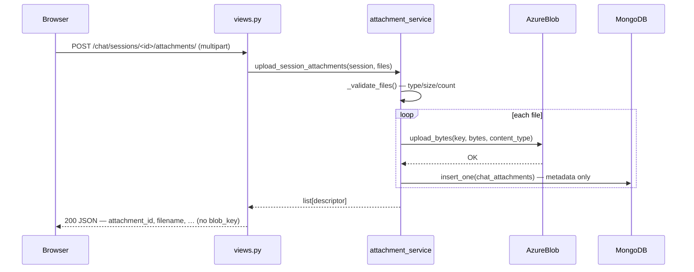
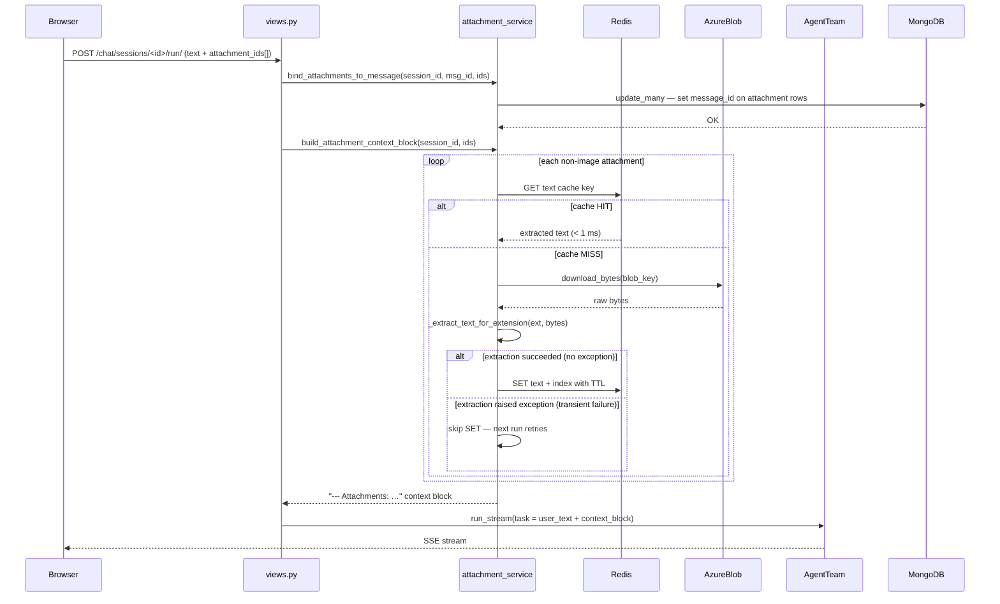
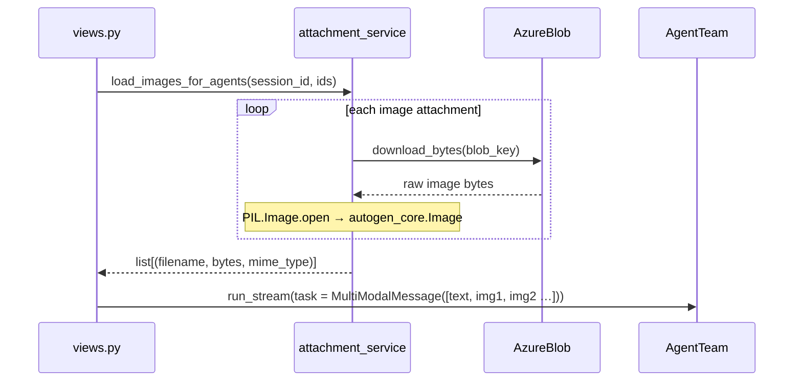
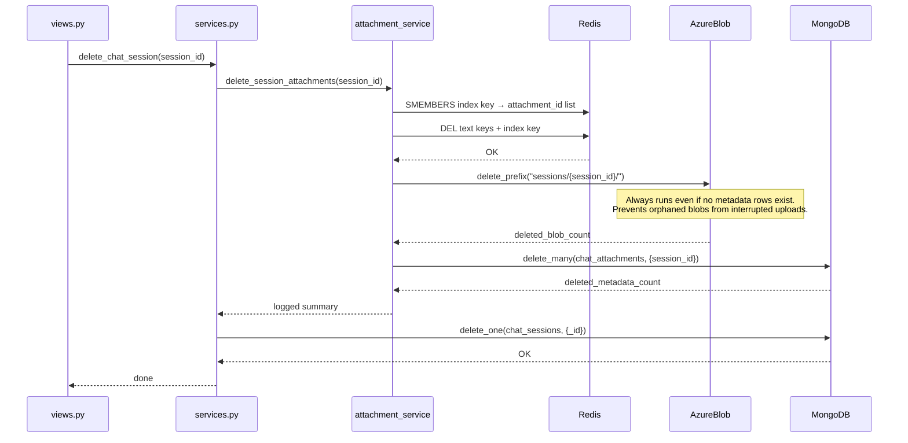

# Chat Attachment Storage — Design Reference

This document explains why the attachment pipeline uses three separate storage layers,
what each layer owns, and how data flows through each operation. Read this before
modifying `server/attachment_service.py`, `server/storage_backends.py`, or any
code that touches `chat_attachments` in MongoDB.

---

## Three-Layer Storage Rationale

The pipeline deliberately spreads data across three stores. They are **not** redundant —
each serves a distinct access pattern.

| Layer | Store | What lives here | Lifetime |
|---|---|---|---|
| **Blob bytes** | Azure Blob `sessions/{session_id}/attachments/{attachment_id}/{filename}` | Raw file bytes for every attachment | Until session is deleted |
| **Metadata registry** | MongoDB `chat_attachments` | Filename, mime-type, size, `blob_key`, `is_image`, `session_id`, `project_id`, `message_id` | Until session is deleted |
| **Extracted text cache** | Redis `{REDIS_NAMESPACE}:attachment:{session_id}:{attachment_id}:text` | Plain text extracted from PDF/DOCX/XLSX/CSV etc. | TTL — default 24 h (`REDIS_ATTACHMENT_TTL_SECONDS`) |
| **Display snapshot** | MongoDB `chat_sessions.discussions[].attachments[]` | Render-only subset: `id`, `filename`, `mime_type`, `size_bytes`, `is_image`, `content_url` | Embedded — gone when session doc is deleted |

### Why not store extracted text in MongoDB?

1. **Document size cap.** MongoDB has a 16 MB per-document BSON limit. A session with
   10 large Excel workbooks could push a session document toward (or past) that limit.
2. **TTL.** Extracted text is an ephemeral runtime artefact — only useful while a run
   is active or may resume. Redis native TTL discards it automatically; MongoDB requires
   a separate cleanup job or TTL index.
3. **Query overhead.** Without TTL, old extracted text accumulates permanently and is
   returned on every `find_one` for the session, wasting memory and bandwidth.

### Why not cache images in Redis?

Image blobs are raw bytes (JPEG, PNG, HEIC …). They are too large for Redis and Redis is
not a blob store. Images are downloaded from Azure Blob on each agent run via
`load_images_for_agents()` and passed directly as `MultiModalMessage` pixel data.
No Redis key is written for images.

### Why does `discussions[].attachments` duplicate metadata?

When the chat history partial renders, it iterates `discussions[]`. Without the embedded
snapshot, every message with attachments would require a separate `chat_attachments`
lookup — one `$in` query per message per page load (30 messages = 30 round-trips).
Embedding a small display-only snapshot makes history rendering a single document read.
The embedded list deliberately omits `blob_key`, `project_id`, and `uploaded_at` —
it carries only what the template needs to draw the chip.

---

## Data Model

### MongoDB `chat_attachments` document

```json
{
  "attachment_id": "uuid",
  "project_id":   "ObjectId hex",
  "session_id":   "ObjectId hex",
  "message_id":   "uuid | null",
  "filename":     "safe_name.pdf",
  "extension":    "pdf",
  "mime_type":    "application/pdf",
  "size_bytes":   102400,
  "is_image":     false,
  "blob_key":     "sessions/{session_id}/attachments/{attachment_id}/safe_name.pdf",
  "uploaded_at":  "<BSON Date UTC>"
}
```

> `extracted_text` and `extraction_status` are **never** written here.
> MongoDB is metadata-only; all text content lives in Redis.

### Redis keys

```
{REDIS_NAMESPACE}:attachment:{session_id}:{attachment_id}:text   # STRING — full extracted text
{REDIS_NAMESPACE}:attachment:{session_id}:index                  # SET   — tracks attachment_ids with cached text
```

Both keys share the same TTL (`REDIS_ATTACHMENT_TTL_SECONDS`, default 86 400 s).
The index SET lets `purge_session_attachment_cache()` find all text keys for a session
in O(1) without a `SCAN`.

### Embedded display snapshot (`discussions[].attachments[]`)

```json
{
  "id":          "uuid",
  "filename":    "report.pdf",
  "mime_type":   "application/pdf",
  "size_bytes":  102400,
  "is_image":    false,
  "extension":   "pdf",
  "content_url": "/chat/sessions/<id>/attachments/<att_id>/content/"
}
```

---

## Sequence Diagrams

### 1 — Upload



No text extraction happens at upload time. The browser receives only display metadata.

---

### 2 — Agent Run (text documents)



---

### 3 — Agent Run (vision images)



Images are never Redis-cached. Each run/resume downloads fresh from blob.

---

### 4 — Session Delete



Delete order is always **Redis → Blob → MongoDB**. Blob deletion always runs for a valid
`session_id` regardless of whether metadata rows exist.

---

## Storage Layer Decision Guide

| Question | Answer |
|---|---|
| Serve raw file bytes to the browser? | Look up `blob_key` in `chat_attachments`, then `download_bytes()`. |
| Pass document text to an agent? | `build_attachment_context_block()` — Redis-cached, lazy. |
| Pass images to a vision model? | `load_images_for_agents()` — blob download, no cache. |
| Render attachment chips in history? | Read `discussions[].attachments[]` — already embedded, no extra query. |
| Find all attachments for a session? | Query `chat_attachments` by `session_id`. |
| Add a new extractable file type? | Add to `_ALLOWED_EXTENSIONS`, add branch in `_extract_text_for_extension`, add SVG icon under `server/static/server/assets/icons/file-{ext}.svg`. |
| Swap Azure for S3? | Implement `StorageStrategy`, register in `build_storage_strategy()`. No other changes needed. |

---

## Key Invariants

1. `blob_key` is **never** exposed to the browser or embedded in `discussions[]`.
2. `extracted_text` / `extraction_status` are **never** written to MongoDB.
3. Blob prefix delete **always runs** for a valid `session_id` — a storage provider
   error logs a warning but does not abort metadata cleanup.
4. Delete order is always: **Redis → Blob → MongoDB**.
5. `message_id` in `chat_attachments` is `null` until `bind_attachments_to_message()`
   is called; unbound rows are still cleaned up on session delete.
6. **Extraction failures are never cached.** If `build_attachment_context_block` raises
   an exception during blob download or text extraction, the result is not written to
   Redis so the next run retries. Genuinely empty documents (e.g. scanned PDFs with no
   text layer) are cached normally to avoid repeated blob downloads.
7. **`discussions[].content` for user messages stores raw task text only** — never the
   `text_with_context` string that includes the extracted attachment block. Extracted
   attachment text is rebuilt at runtime from Blob → Redis; persisting it in MongoDB
   would duplicate ephemeral data, inflate document size, and corrupt the export
   reference text used by Trello/Jira modals.
