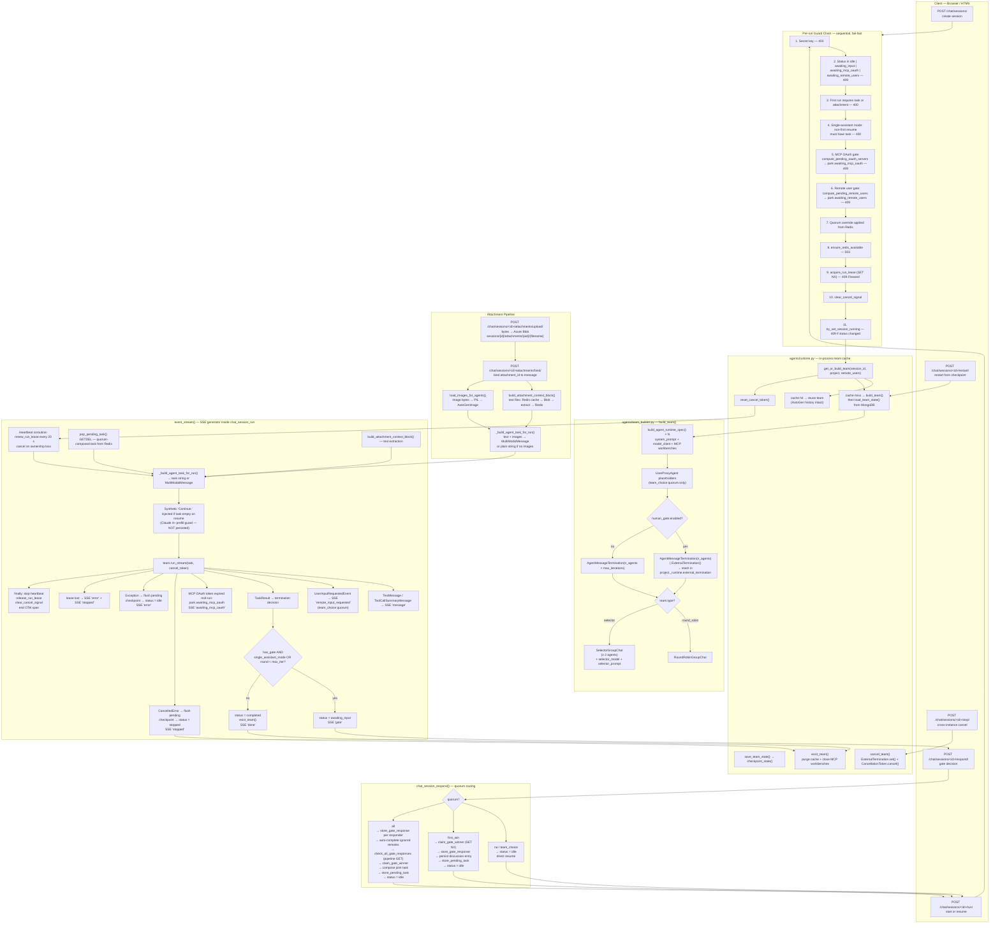

# Chat Session Lifecycle

> **Context:** This document covers the full technical lifecycle of a CouncilAI chat session — from creation through streaming agent runs, quorum-gated human responses, state persistence, and cleanup. For the business model that motivates this design (why human experts gate every agent round), see [PROJECT_CHARTER.md](../PROJECT_CHARTER.md). For HTTP routes and response shapes, see [API.md](API.md). For the broader system architecture, see [ARCHITECTURE.md](ARCHITECTURE.md).

---

## Lifecycle Overview



---

## 1. Session Initialization — `chat_session_create()`

`POST /chat/sessions/` → `server/views.py`

- Secret-key gated (`X-App-Secret-Key` header).
- Calls `services.create_chat_session(project_id, description)` → MongoDB document with `status: "idle"`, empty `discussions[]`, `current_round: 0`.
- Returns HTMX OOB swaps: `#chat-history-list` (session list), `#chat-messages` (history panel), `#active-session-id` (hidden input).
- **No team is built at creation** — team construction is deferred to the first `/run/`.

---

## 2. Run / Resume — `chat_session_run()`

`POST /chat/sessions/<id>/run/` — async ASGI view, returns `text/event-stream`.

### 2a. Pre-run guard chain (sequential, fail-fast)

| # | Guard | Failure |
|---|---|---|
| 1 | Secret key (`X-App-Secret-Key`) | 403 |
| 2 | Session status not in `{idle, awaiting_input, awaiting_mcp_oauth, awaiting_remote_users}` | 409 |
| 3 | First run with no `task` and no `attachment_ids` | 400 |
| 4 | Single-assistant chat mode + non-first resume + empty task | 400 |
| 5 | Pending MCP OAuth servers (pre-run) → park `awaiting_mcp_oauth`, init readiness counter | 409 |
| 6 | Pending remote users not online → park `awaiting_remote_users` | 409 |
| 7 | Per-session quorum override read from Redis and deep-copied into project | — |
| 8 | `ensure_redis_available()` — Redis ping | 503 |
| 9 | `acquire_run_lease()` — Redis SET NX | 409 |
| 10 | `clear_cancel_signal()` | — |
| 11 | `try_set_session_running()` — atomic status move | 409 |

After all guards pass, `event_stream()` is returned as a `StreamingHttpResponse`.

### 2b. Inside `event_stream()` — the SSE generator

**Team resolution** — `get_or_build_team(session_id, project, remote_users)`:
- **Cache hit** → reuses the existing in-process `RoundRobin/SelectorGroupChat` (AutoGen internal history is intact).
- **Cache miss** → calls `build_team()`, then `load_team_state()` to restore from MongoDB `agent_state`.
- If state restoration fails with a version mismatch → SSE `"error"` + status `stopped`.

**Heartbeat** — a background `asyncio` coroutine calls `renew_run_lease()` every `REDIS_RUN_HEARTBEAT_SECONDS` (default 20 s). If the Lua compare-and-set fails (ownership lost), it cancels the token immediately and sets `lease_lost = True`.

**Task assembly** (in order):
1. `pop_pending_task()` — atomic GETDEL from Redis; present when quorum deposited a composed task.
2. Otherwise: `task` + `attachment_ids` from POST body.
3. `build_attachment_context_block()` — extracted text from documents appended as `--- Attachments:` block (see §3).
4. `_build_agent_task_for_run()` — if images are present, wraps everything as `MultiModalMessage`; otherwise plain string.
5. If task is empty on a non-first resume → synthetic `"Continue."` injected (Claude 4+ prefill guard). **Not persisted**.

**`team.run_stream()` loop** — emits:

| SSE event | When emitted |
|---|---|
| `message` | `TextMessage` or `ToolCallSummaryMessage` where `source != "user"` |
| `remote_input_requested` | `UserInputRequestedEvent` (team_choice quorum proxy turn) |
| `gate` | `TaskResult` when gate is active and round limit not reached |
| `done` | `TaskResult` when run completes (no further gate round) |
| `awaiting_mcp_oauth` | Team build / load fails because MCP OAuth token expired mid-run |
| `error` | Lease lost, state mismatch, or any unhandled exception |
| `stopped` | `CancelledError` (graceful cancel or cross-instance stop) |

**Termination decision** at `TaskResult`:
- `has_gate AND (single_assistant_mode OR current_round < max_iterations)` → status `awaiting_input`, SSE `"gate"`.
- Otherwise → status `completed`, `evict_team()`, SSE `"done"`.

**Error paths**:
- `CancelledError` → flush pending messages, `checkpoint_state()`, status `stopped`, SSE `"stopped"`.
- Other exceptions → flush pending, `checkpoint_state()`, status `idle`, SSE `"error"` (unwrapped via `_friendly_run_error()`).
- **Lease lost** → SSE `"error"` (lease message) + SSE `"stopped"`.
- `finally` always: stop heartbeat event, `release_run_lease()`, `clear_cancel_signal()`, end OTel span, detach context.

---

## 3. Attachment Pipeline

Attachments are three-layer: **Azure Blob** (bytes), **MongoDB** (metadata), **Redis** (lazy-extracted text cache).

### Upload & bind

| Step | Endpoint | What happens |
|---|---|---|
| Upload | `POST /chat/sessions/<id>/attachments/upload/` | Bytes written to Blob at `sessions/{session_id}/attachments/{aid}/{filename}`; metadata inserted in MongoDB |
| Bind | `POST /chat/sessions/<id>/attachments/bind/` | `attachment_id` linked to a `message_id`; no blob rename |
| Validate | On every `/run/` | Server validates `session_id` ownership for every submitted `attachment_id` |

### Text extraction (lazy, Redis-backed)

`attachment_service.build_attachment_context_block()`:
1. Check Redis: `{NS}:attachment:{session_id}:{attachment_id}:text` (24 h TTL).
2. **Hit** → return cached text (< 1 ms).
3. **Miss + success** → download from Blob, extract, write to Redis, return.
4. **Miss + failure** → NOT cached; next run retries. Extraction failures are never permanent.

Supported extractable types: PDF (≤ 50 pages), DOCX, PPTX (≤ 50 slides), XLSX/XLS (all sheets, tab-separated rows), CSV (≤ 200 rows), TXT, MD, JSON.

### Image handling

`attachment_service.load_images_for_agents()` downloads image bytes from Blob on each run. `_build_agent_task_for_run()` wraps them as `autogen_core.Image(PIL.Image.open(...))` and returns a `MultiModalMessage`. If any image download fails, that image is silently skipped; if all fail, falls back to plain string.

### Invariant (rule 71)

`discussions[].content` stores **raw user-typed text only** — never the `text_with_context` string that includes the extracted attachment block. Extracted text is a runtime artefact assembled from Blob → Redis on each run.

### Cleanup

Session delete: `purge_session_attachment_cache(session_id)` (Redis) → delete blob prefix `sessions/{session_id}/` → delete MongoDB metadata rows — in that order.

---

## 4. Team Building — `build_team()`

Source: `agents/team_builder.py`

```
project.agents → build_agent_runtime_spec() × N
  ├── system_prompt (+ objective injected)
  ├── model_client from agent_models.json
  └── MCP workbenches (scope: none | shared | dedicated)

+ UserProxyAgent placeholders (team_choice quorum only)
  └── placeholder input_func → auto-returns "Continue."

Termination:
  human_gate ON  → AgentMessageTermination(n_agents) | ExternalTermination()
                   ExternalTermination stashed in project._runtime.external_termination
  human_gate OFF → AgentMessageTermination(n_agents × max_iterations)

Team type:
  "round_robin" → RoundRobinGroupChat(agents, termination)
  "selector"    → SelectorGroupChat(agents, selector_model, selector_prompt, termination)
                  (requires ≥ 2 agents; invalid for single-assistant)
```

**Key invariant** — `AgentMessageTermination` counts only messages where `source != "user"`, avoiding the off-by-one caused by AutoGen's built-in `MaxMessageTermination` including the task message in its count (rule 70).

---

## 5. Single-Assistant Chat Mode

Triggered when all three conditions are true:
- `human_gate.enabled == True`
- `len(project.agents) == 1`
- `human_gate.remote_users` is empty

| Behaviour | Detail |
|---|---|
| Team Setup hidden | Not visible in project config UI |
| Human Gate mandatory | Cannot be disabled |
| Gate mode | Run pauses after every assistant turn |
| Completion | Only when human clicks **Stop** — no `max_iterations` limit |
| Empty Continue blocked | HTTP 400 before lease acquired; frontend disables Send until text or file present |
| `chat_mode` in gate SSE | `"single_assistant"` (rendered in gate badge, no `/M` counter) |

**Exception** — when `remote_users` is non-empty with a single assistant, the project exits pure single-assistant mode: Team Setup is visible, `max_iterations` is honored, empty Continue is allowed. Selector team type remains invalid (requires ≥ 2 agents).

---

## 6. Quorum & Remote Users

Config in `project.human_gate` (validated in `server/schemas.py`):

```json
{
  "enabled": true,
  "name": "host_name",
  "quorum": "na | first_win | all | team_choice",
  "remote_users": [{"name": "...", "description": "..."}]
}
```

`quorum` is forced to `"na"` when `remote_users` is empty.

### Quorum routing in `chat_session_respond()`

| `quorum` | Behaviour | HTTP on accept | HTTP on race |
|---|---|---|---|
| `na` | Gate user responds → status `idle` immediately | 200 | — |
| `team_choice` | Same as `na`; `UserProxyAgent` placeholders handle in-run routing | 200 | — |
| `first_win` | `claim_gate_winner()` SET NX — first POST wins; late POSTs get 409 | 200 | 409 |
| `all` | All non-ignored participants must respond; host's POST triggers auto-completion for ignored remotes; then `claim_gate_winner()` and compose task | 200 (last to fill) / 202 (still waiting) | — |

Ignored remote users (status `"ignored"`) are excluded from the expected responder list via `_resolve_gate_expected_names()`.

### Quorum composition (`all` mode)

When all gate responses are collected:
1. Responses fetched in configured remote-user order, gate user last.
2. `_build_quorum_composed_payload()` assembles a markdown task with per-responder headers.
3. Merged `attachment_ids` collected across all responders.
4. Composed task deposited in Redis via `store_pending_task()`.
5. Session status set to `idle` → next `/run/` picks up the composed task atomically via `pop_pending_task()` (GETDEL).

---

## 7. Deferred Readiness Latch

When a **required remote participant disconnects while a run is already in progress**:

1. Current run continues uninterrupted.
2. `set_remote_user_readiness_latch(session_id, user_name)` sets `{NS}:remote_user:{session_id}:readiness_latch` (TTL = `REDIS_REMOTE_USER_TOKEN_TTL_SECONDS`, default 6 h).
3. Next `POST /chat/sessions/<id>/run/` enters the remote-user pre-run gate (guard 6) and is blocked.
4. Latch is cleared by `clear_remote_user_readiness_latch()` when readiness is satisfied or on session-key purge at session delete.

The latch applies only to configured `remote_users`, never to guest watchers, and never triggers for users already marked `ignored`.

---

## 8. MCP OAuth Gate

### Pre-run (guard 5)

1. `compute_pending_oauth_servers()` — list servers with registered OAuth config that have no session-scoped Bearer token in Redis.
2. Any pending → `init_mcp_oauth_readiness(session_id, authorized_count)`, `set_session_awaiting_oauth()`, return **409** with `{"status": "awaiting_mcp_oauth", "servers": [...]}`.
3. Frontend renders the in-history OAuth card. No run lease is acquired.

### Mid-run (MCP token expired during team build/load)

1. Team build or `load_team_state()` fails.
2. `compute_pending_oauth_servers()` re-called.
3. Pending servers found → same Redis + status update as pre-run, emit SSE `"awaiting_mcp_oauth"`.
4. `event_stream()` returns without persisting agent state.

### Token lifecycle

| Action | Redis key |
|---|---|
| Store token | `{NS}:mcp_oauth:run:{session_id}:{server_name}:token` (TTL from JWT `exp`) |
| List authorized | `{NS}:mcp_oauth:run:{session_id}:servers` |
| Readiness pub/sub | `{NS}:mcp_oauth:readiness:{session_id}` |
| PKCE state | `{NS}:mcp_oauth_state:{state}:meta` (5 min, delete-on-read) |
| Config test status | `{NS}:mcp_oauth:test:{project_id}:{server_name}:status` (10 min) |
| Cleanup | `purge_mcp_oauth_tokens(session_id)` on session delete |

---

## 9. Stop / Cancel

| Action | How |
|---|---|
| **Graceful stop** (Stop button) | `chat_session_respond(action="stop")` → `cancel_team()` → `evict_team()` → status `stopped` |
| **Cross-instance cancel** | `POST /chat/sessions/<id>/stop/` → `signal_cancel()` sets `{NS}:chat_session:{id}:cancel`; running instance polls `is_cancel_signaled()` each message → triggers `cancel_token.cancel()` |
| **In-process cancel** | `cancel_team()` → `ExternalTermination.set()` (graceful finish of current agent turn) then `CancellationToken.cancel()` (hard interrupt fallback) |

`chat_session_stop()` returns 200 on success, 403 if unauthorized, 503 if Redis unavailable.

---

## 10. State Persistence & Resume

- After every `TaskResult`: `save_team_state()` serializes AutoGen internal state → `chat_sessions.agent_state` in MongoDB.
- `MAX_AGENT_STATE_BYTES` (default 1 MB, env var) guards document size. `checkpoint_state()` catches `ValueError` on overflow, logs `agents.session.state_too_large` at WARNING, and lets the run complete. Resume is unavailable when state cannot be persisted.
- On cache miss (server restart / new instance / first run): `load_team_state()` restores full AutoGen conversation history.
- Team cache is **process-local** — horizontal scaling requires sticky sessions at the load balancer (live asyncio tasks, agent instances, MCP sockets cannot serialize).

---

## 11. Guest Readonly Sessions

- Host generates a per-session guest URL via `POST /chat/sessions/<id>/guest-link/`.
- Token stored at `{NS}:guest_user:{session_id}:token` and reverse lookup at `{NS}:guest_user:token:{token}`.
- Guest page is readonly — no send box, no attach controls, no mutations.
- Live updates stream via WebSocket (`/ws/session/<session_id>/`) while the host run is active.
- Token revoked and blob/Redis cleaned up when session is deleted.

---

## 12. Remote Export Keys

When a host grants a remote user export access from the readiness card:

1. A short-lived per-user export key is generated and stored:
   - `{NS}:remote_user:{session_id}:{user_name}:export_key` — the key value
   - `{NS}:remote_export:key:{export_key}` — reverse lookup (key → `{session_id, user_name}`)
2. Key delivered to the remote user's page via WebSocket in real time.
3. Export action buttons appear on all agent bubbles without a page reload.
4. Session-scoped Trello and Jira endpoints validate via `has_valid_session_auth()` (accepts both admin secret and impersonated export key).
5. Key TTL = `REDIS_REMOTE_USER_TOKEN_TTL_SECONDS` (default 6 h). Purged on session delete.

---

## 13. W3C Traceparent Propagation

A fresh root OpenTelemetry span is created for each `/run/` call:

1. `start_root_span("agents.session.run", ...)` → `_run_span`, `_run_traceparent` (W3C `traceparent` header string).
2. Traceparent stored in Redis at `{NS}:chat_session:{session_id}:run_trace` (same TTL as the run lease).
3. `event_stream()` reattaches this context via `context_from_traceparent()` so all agent logs and child spans inherit the same `trace_id` even after the Django middleware has cleared the request context.
4. Span ended in the `finally` block after the SSE stream closes.

---

## 14. Session Restart — `chat_session_restart()`

`POST /chat/sessions/<id>/restart/` → restores the session from its persisted `agent_state` checkpoint without creating a new MongoDB document.

- Secret-key gated.
- Calls `load_team_state()` directly (bypasses the full guard chain of `/run/`).
- Two UI options presented in the chat history restart card:
  - **Continue from last** — resumes with empty task.
  - **Add context and continue** — user types extra context, which becomes the task.
- Typing in the main send box while a restart card is visible starts a **new** session, not a resume.

---

## 15. Export Providers per Agent Message

After each `TaskResult`, each agent message is annotated with `visible_export_providers` — the list of export provider buttons (Trello, Jira Software, etc.) that should appear on that bubble. Computed by `_filter_export_providers(export_meta, agent_name)`:

- If a provider's `export_agents` list is empty → shown on all agent messages.
- If non-empty → shown only when `agent_name` is in the list.
- Stale names (agent renamed or removed) are reset to `[]` silently (rule 73).

---

## Redis Key Reference

All keys use the prefix `{NS}` = `REDIS_NAMESPACE` setting (default `product_discovery`).

### Run coordination

| Key pattern | Purpose | TTL source |
|---|---|---|
| `{NS}:chat_session:{id}:active_lease` | Active run ownership (Lua compare-and-set heartbeat) | `REDIS_RUN_LEASE_TTL_SECONDS` (default 300 s) |
| `{NS}:chat_session:{id}:cancel` | Cross-instance cancel signal | `REDIS_CANCEL_SIGNAL_TTL_SECONDS` (default 120 s) |
| `{NS}:chat_session:{id}:run_trace` | W3C traceparent for OTel span reattach | Same as lease TTL |

### MCP OAuth

| Key pattern | Purpose | TTL source |
|---|---|---|
| `{NS}:mcp_oauth:run:{id}:{server}:token` | Session-scoped Bearer token | JWT `exp` claim (min 60 s) |
| `{NS}:mcp_oauth:run:{id}:servers` | Count of authorized servers | Same as token |
| `{NS}:mcp_oauth:readiness:{id}` | Pub/sub channel for progress updates | — |
| `{NS}:mcp_oauth_state:{state}:meta` | PKCE state for Authorization Code flow | 5 min, delete-on-read |
| `{NS}:mcp_oauth:test:{project}:{server}:status` | Config-form credential test status | 10 min |

### Gate responses & quorum

| Key pattern | Purpose | TTL source |
|---|---|---|
| `{NS}:gate_response:{id}:{round}:{name}` | Per-responder gate input (round-scoped) | `_GATE_RESPONSE_TTL` |
| `{NS}:gate_winner:{id}:{round}` | First-win / all-quorum race lock (round-scoped) | `_GATE_RESPONSE_TTL` |
| `{NS}:pending_task:{id}` | Quorum-composed task; consumed atomically (GETDEL) | `_PENDING_TASK_TTL` (5 min) |
| `{NS}:quorum:{id}` | Per-session quorum override (set via dropdown) | `REDIS_REMOTE_USER_TOKEN_TTL_SECONDS` |

### Team choice proxy

| Key pattern | Purpose | TTL |
|---|---|---|
| `{NS}:team_choice:{id}:active_request` | Current proxy turn request | Short-lived |
| `{NS}:team_choice:{id}:request:{req_id}:response` | Remote user's response payload | Short-lived |
| `{NS}:team_choice:{id}:request:{req_id}:claimed` | Race claim for response | Short-lived |
| `{NS}:team_choice:{id}:turn_events` | Pub/sub channel for turn events | — |

### Remote user & guest

| Key pattern | Purpose | TTL source |
|---|---|---|
| `{NS}:remote_user:{id}:{name}:token` | Invitation token for remote user | `REDIS_REMOTE_USER_TOKEN_TTL_SECONDS` (6 h) |
| `{NS}:remote_user:token:{token}` | Reverse lookup: token → `{session_id, user_name}` | Same |
| `{NS}:remote_user:{id}:{name}:export_key` | Per-user impersonated export key | Same |
| `{NS}:remote_export:key:{key}` | Reverse lookup: export_key → `{session_id, user_name}` | Same |
| `{NS}:remote_user:{id}:{name}:status` | Online / offline / ignored | Same |
| `{NS}:remote_user:readiness:{id}` | Pub/sub channel for status updates | — |
| `{NS}:remote_user:{id}:readiness_latch` | Deferred readiness gate (set on disconnect) | Same |
| `{NS}:guest_user:{id}:token` | Guest readonly token value | Same |
| `{NS}:guest_user:token:{token}` | Reverse lookup: guest token → session_id | Same |
| `{NS}:guest_user:{id}:status` | Guest presence | — |

### Attachment cache

| Key pattern | Purpose | TTL source |
|---|---|---|
| `{NS}:attachment:{id}:{aid}:text` | Lazy-extracted text from document | `REDIS_ATTACHMENT_TTL_SECONDS` (24 h) |

---

## SSE Event Reference

All events emitted by `_sse(event, data)` inside `event_stream()`.

| Event | When | Key data fields |
|---|---|---|
| `message` | Agent turn (`TextMessage`, `source != "user"`) | `agent_name`, `content`, `timestamp`, `visible_export_providers` |
| `gate` | Run paused awaiting human input | `round`, `max_rounds`, `human_name`, `chat_mode`, `quorum` |
| `done` | Run completed (no further gate) | `status`, `round` |
| `stopped` | `CancelledError` — graceful cancel | `status: "stopped"` |
| `error` | Any exception, lease loss, state mismatch | `message` (user-friendly string) |
| `remote_input_requested` | `UserInputRequestedEvent` (team_choice quorum) | `proxy_name`, `request_id` |
| `awaiting_mcp_oauth` | MCP OAuth token expired during team build | `servers` (list of pending server names) |

---

## HTTP Status Code Reference

### `POST /chat/sessions/<id>/run/`

| Code | Condition |
|---|---|
| 200 | StreamingHttpResponse (`text/event-stream`) |
| 400 | No task on first run, or single-assistant empty continue |
| 403 | Unauthorized |
| 404 | Session or project not found |
| 409 | Status invalid, MCP OAuth pending, remote users not ready, lease already held, status changed before run start |
| 503 | Redis unavailable |

### `POST /chat/sessions/<id>/respond/`

| Code | Condition |
|---|---|
| 200 | Response accepted; task deposited; session set to idle |
| 202 | `all` quorum — response accepted but waiting for remaining participants |
| 400 | Invalid `action` value |
| 403 | Unauthorized |
| 404 | Session not found |
| 409 | Session not in `awaiting_input`, or gate already claimed (`first_win` race loss) |

### `POST /chat/sessions/<id>/stop/`

| Code | Condition |
|---|---|
| 200 | Cancel signal sent |
| 403 | Unauthorized |
| 503 | Redis unavailable |

---

## Key Invariants

| Invariant | Rule |
|---|---|
| `discussions[].content` = raw user text only | Rule 71 — never `text_with_context` |
| Blob key is flat and permanent | `sessions/{session_id}/attachments/{aid}/{filename}` — never renamed at bind |
| Team cache is process-local | Live asyncio + AutoGen + MCP sockets cannot serialize; requires sticky sessions |
| Quorum and remote_users from live project | Never stored in `chat_sessions`; applied at run start from project config + Redis override |
| Cancellation is two-layered | `ExternalTermination.set()` (graceful) + `CancellationToken.cancel()` (hard interrupt fallback) |
| Agent state persistence is non-fatal | `checkpoint_state()` catches `ValueError` on `MAX_AGENT_STATE_BYTES` overflow; run continues, resume unavailable |
| Synthetic `"Continue."` is not persisted | Claude 4+ prefill guard; injected only into the model call, never into `discussions[]` |
| Redis is fail-fast on run start | `ensure_redis_available()` returns 503 before any run transition if Redis is unreachable |
